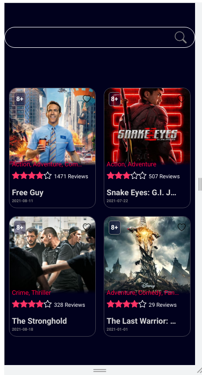
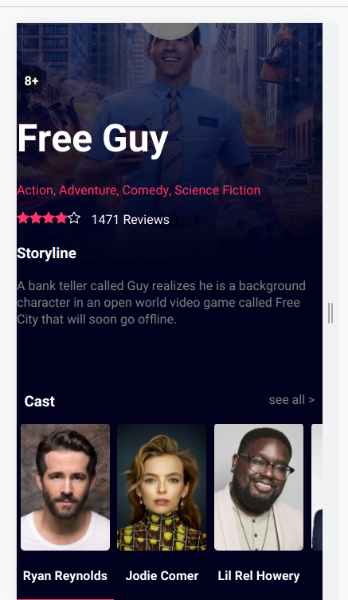
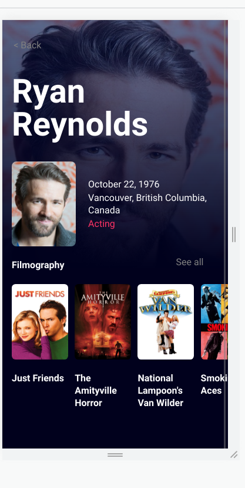

# MOVIE APP CHALLENGE

This is a small app that pretends to do a simple movie showcase and gives you a brief bio of every actor you can find in those movies. The data is fetched from "The movie database" API and then displayed on different cards, with a functional search bar.
The app was developed thinking of a mobile-first paradigm and is best suited for smartphone displays even though is responsive to 1920px width screens.

## Installation

To get the code of the project up and running on your PC simply clone the repo, install the needed dependencies via "npm install" and get yourself a free API key on The movie database website.
After that place that API KEY on your .env file under the name of "REACT__APP__NEWAPIKEY".

-- https://www.themoviedb.org/

```bash
$ npm install
```

* Here is the home screen of the App. If you press on tap the movie name you will be redirected to that movie individual page.



* On the movie page, you will see a brief overview of the plot and the main cast members that took part in it. Tapping any member of the cast will redirect you to its personal profile.



* Finally once you are on the actor profile page you will be able to check his/her filmography and also down below there will be a little bio for you to read.


## Technologies
This app was built using:

* React js

* sass

* The movie DB API

* Aos library for animations


The code was developed using mainly React class components.
